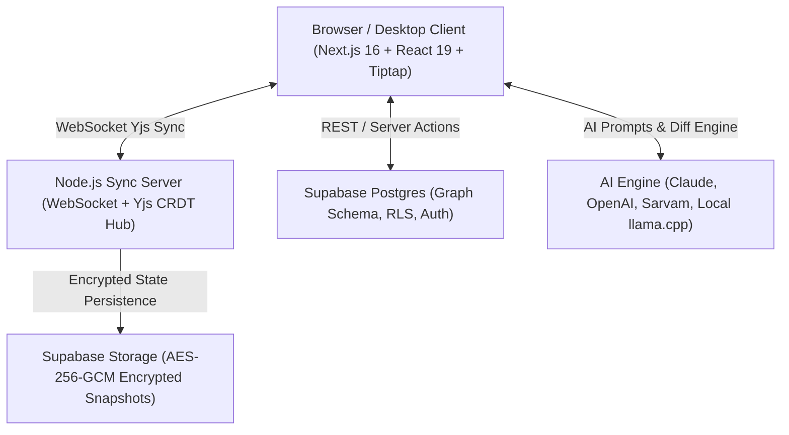

# Lekhan 🪶

<div align="center">

**The AI-native, collaborative knowledge workspace.**  
*Local-first like Obsidian. Collaborative like Notion. AI on your terms.*

[](#-testing)
[](https://nextjs.org/)
[](https://react.dev/)
[](https://yjs.dev/)
[](#-security--encryption)
[](LICENSE)

[Early Access Waitlist](https://lekhan.app/early) · [Report Bug](https://github.com/coderhd/lekhan/issues) · [Roadmap](#-product-roadmap)

</div>

---

## 🌟 What is Lekhan?

**Lekhan** is an open-source knowledge workspace designed for thinkers, builders, and teams. It bridges the gap between **local-first privacy** and **seamless cloud collaboration**, ensuring you never have to choose between owning your data and collaborating in real-time.

* **One Knowledge Graph, Many Views**: Every page is a node in your personal knowledge graph. Backlinks, tags, databases, and visual graphs all operate on the same unified substrate.
* **Local-First & Offline-Ready**: Sub-millisecond typing latency. Edit completely offline; changes automatically sync and merge conflict-free via CRDTs when you reconnect.
* **Encrypted at Rest**: Document snapshots and version checkpoints are secured with envelope **AES-256-GCM** encryption (ADR 0001).
* **AI on Your Terms**: Native support for Anthropic Claude, OpenAI, and Sarvam AI (Indic language models), with Bring-Your-Own-Key (BYOK) privacy and upcoming local LLM sidecars.

---

## ✨ Key Features

### 📝 Collaborative Editor & Knowledge Graph
* **Conflict-Free Real-Time Collaboration**: Powered by **Yjs CRDTs** and WebSockets with live multi-user cursor presence.
* **Interactive Wikilinks**: Type `[[Page Title]]` or `[[Target|Alias]]` to dynamically link notes. Click to navigate or instantly create missing pages.
* **Rich Markdown Support**: Seamless block editor with Callouts, Code Blocks (syntax-highlighted with Lowlight), Tables, Task Lists, and Slash Commands (`/`).
* **Universal Import & Export**: Full round-trip Markdown fidelity, native **Obsidian Vault Importer**, and one-click export to Markdown (`.md`), HTML, DOCX, and PDF.

### 🧠 Built-in AI Companion
* **In-Context AI Writing Assistant**: Ask Lekhan Bot (`Cmd/Ctrl + L`), trigger inline bubble menus, and generate diff previews before applying changes.
* **Multi-Provider & Indic Language Support**: Built-in support for Claude 3.5, OpenAI GPT-4o, and Sarvam AI models for multilingual synthesis.
* **Privacy-First**: No note titles, content, or sensitive payloads are tracked in analytics or sent to third parties without your permission.

### 🔒 Security & Versioning
* **Snapshot Encryption at Rest**: Encrypted using AES-256-GCM with authenticated headers (`LK_ENC_V1`) and multi-key rotation runbooks.
* **Role-Based Access Control**: Granular permissions (Owner, Editor, Viewer) enforced at the database (RLS) and sync layers.
* **Interactive Version History**: View timeline snapshots, preview previous states, and restore checkpoints non-destructively.

### ⚡ Search & Navigation
* **Keyboard-First Global Search**: Instant `Cmd + K` search across page titles, tags, and document contents with fuzzy matching.

---

## 🗺️ Product Roadmap

Lekhan's development is structured across distinct horizons. Public beta release is quality-gated by the [#79 UX-parity bar](https://github.com/coderhd/lekhan/issues/79).

### 🚀 Horizon 0 — Foundation & Public Beta (Current)

- [x] **Pages Graph Foundation**: Postgres schema, page links, page tags, and graph indexer.
- [x] **Real-Time Sync Engine**: Node.js WebSocket hub with Yjs CRDT state persistence.
- [x] **Markdown Round-Trip Engine**: Zero-loss import/export across Tiptap and standard Markdown.
- [x] **Obsidian Importer**: One-click ingestion of folders, attachments, and wikilinks.
- [x] **Snapshot Encryption at Rest (ADR 0001)**: AES-256-GCM envelope encryption for all stored snapshots.
- [x] **Interactive Wikilinks**: Resolved link chips and on-the-fly page creation (`[[Target]]`).
- [x] **Global Search**: Instant keyboard-first palette (`Cmd+K`).
- [x] **Early Access Waitlist**: Live at `/early` with double opt-in.
- [ ] **Tier Plumbing & Storage Caps** (`#82`): Granular quota enforcement.
- [ ] **AI Provider Registry & BYOK** (`#28`): User-managed API keys and multi-model router.
- [ ] **Private Beta Launch**: Invites roll to waitlist users.
- [ ] **Billing & Regional Pricing** (`#29`): Stripe + Razorpay with perpetual free tier.
- [ ] **Tauri Desktop Shell** (`#88`): Vault-on-disk (ADR 0003) with local `llama.cpp` sidecar.
- [ ] **Internationalization (i18n)** (`#31`) & Public Documentation (`#32`).

### 🌲 Horizon 1 — PKM Depth ("The Second Brain")

- [ ] **Interactive Visual Graph**: 2D/3D force-directed knowledge graph with filterable tags and clusters.
- [ ] **Dual-Dialect Interop Bridge (`#78`)**: Seamless bidirectional compatibility between Obsidian and Notion formats.
- [ ] **Daily Notes & Quick Capture**: Calendar-linked journaling and instant inbox.
- [ ] **Notion Importer (`#45`)**: Structured block-level Notion workspace migration.
- [ ] **Public Publishing (`#40`)**: Fast, SEO-optimized public note sharing.
- [ ] **Mobile Companion (`#43`)**: Native iOS & Android apps via Tauri mobile.
- [ ] **Plugin System & Open-Core SDK (`#44`)**: Community extensions and themes.

### 🏢 Horizon 2 & 3 — Notion-Grade Structure & The Suite

- [ ] **Databases as Typed Views**: Tables, Kanban Boards, Calendars, and Galleries over the knowledge graph.
- [ ] **Autonomous In-Workspace AI Agents**: Background synthesis, link suggestions, and auto-tagging.
- [ ] **Team Workspaces**: SSO, audit logs, and organization management.
- [ ] **AI-Native Office Suite**: Connected Sheets, Slides, Mail, and Chat.

---

## 🏗️ Architecture



### Technology Stack
* **Framework**: [Next.js 16](https://nextjs.org/) (App Router, Turbopack) & [React 19](https://react.dev/)
* **Editor Substrate**: [Tiptap 2](https://tiptap.dev/) / [ProseMirror](https://prosemirror.net/) with custom decoration & node extensions
* **Collaboration & CRDTs**: [Yjs](https://yjs.dev/) + `y-prosemirror` + `y-websocket`
* **Styling & UI**: [Tailwind CSS](https://tailwindcss.com/), [Radix UI](https://www.radix-ui.com/), [Lucide Icons](https://lucide.dev/)
* **Backend & Database**: [Supabase](https://supabase.com/) (PostgreSQL with RLS, Auth, Storage)
* **Encryption**: Node.js `crypto` with `aes-256-gcm` envelope encryption
* **Testing**: [Vitest](https://vitest.dev/) (Unit & Integration) & [Playwright](https://playwright.dev/) (End-to-End)

---

## 📂 Project Structure

```text
├── app/                  # Next.js App Router (pages, layouts, API endpoints)
│   ├── api/              # API routes (/api/ai, /api/version, /api/import, /api/waitlist)
│   ├── doc/[id]/         # Legacy document route
│   ├── page/[id]/        # Pages knowledge graph workspace
│   └── early/            # Waitlist & early access landing
├── components/           # React UI components
│   ├── ui/               # Radix / Shadcn accessible UI primitives
│   ├── editor-workspace.tsx # Core collaborative Tiptap editor
│   ├── lekhan-bot-bar.tsx# In-editor AI assistant
│   └── global-search-palette.tsx # Cmd+K Search modal
├── docs/                 # Product specs, ADRs, runbooks, and roadmaps
│   ├── adr/              # Architecture Decision Records (ADR 0001 - 0004)
│   ├── reviews/          # Clean-room code review audit reports
│   └── roadmap.md        # Detailed internal product roadmap & issue tracking
├── lib/                  # Utilities, crypto engine, wikilink extension, analytics
│   ├── server-crypto.ts  # AES-256-GCM encryption & key rotation
│   ├── wikilink.ts       # Wikilink ProseMirror decoration extension
│   └── markdown-export.ts# Markdown & HTML serialization
├── scripts/              # Migration, backfill, and autonomous code review scripts
│   ├── review-pr.ts      # Clean-room multi-model AI code reviewer
│   └── encrypt-at-rest-backfill.ts # Encryption backfill utility
├── server/               # Collaborative Yjs WebSocket sync server
│   └── index.js          # Sync server with snapshot encryption
└── tests/                # Comprehensive test suite (Vitest + Playwright)
    └── unit/             # 54 test files (408+ automated tests)
```

---

## 💻 Getting Started

### Prerequisites
* **Node.js**: v20.0.0 or higher (v24 recommended)
* **npm** or **pnpm**
* A [Supabase](https://supabase.com) project

### Installation

1. **Clone the repository**:
   ```bash
   git clone https://github.com/coderhd/lekhan.git
   cd lekhan
   ```

2. **Install dependencies**:
   ```bash
   npm install
   ```

3. **Configure Environment Variables**:
   Copy `.env.example` to `.env.local` and populate the required keys:
   ```bash
   cp .env.example .env.local
   ```
   ```env
   NEXT_PUBLIC_SUPABASE_URL=your_supabase_project_url
   NEXT_PUBLIC_SUPABASE_ANON_KEY=your_supabase_anon_key
   SUPABASE_SERVICE_ROLE_KEY=your_supabase_service_role_key

   # Encryption at Rest (ADR 0001)
   LEKHAN_ENCRYPTION_KEY=your_32_byte_base64_or_hex_key

   # AI Integrations (Optional / BYOK)
   ANTHROPIC_API_KEY=your_claude_api_key
   OPENAI_API_KEY=your_openai_key
   SARVAM_API_KEY=your_sarvam_key
   ```

4. **Run the Development Server**:
   ```bash
   # Starts Next.js app and local sync server
   npm run dev
   ```
   Open [http://localhost:3000](http://localhost:3000) in your browser.

---

## 🧪 Testing & Verification

Lekhan maintains a strict verification bar. No code lands without passing the full suite:

```bash
# Run type check
npm run typecheck

# Run linter
npm run lint

# Run all 400+ Vitest unit and integration tests
npm test

# Build for production (Turbopack)
npm run build
```

---

## 🤝 Contributing

We welcome contributions from the community!

1. Fork the repository and create your feature branch: `git checkout -b feat/my-feature`.
2. Follow our commit convention: `feat(...)`, `fix(...)`, `docs(...)`, `refactor(...)`.
3. Ensure all tests pass (`npm test && npm run typecheck`).
4. Submit a Pull Request. Every PR is automatically audited by our clean-room peer review workflow.

---

## 📄 License

Lekhan is licensed under the **[GNU Affero General Public License v3.0 (AGPL-3.0)](LICENSE)** with an **MIT Open-Core Exception** for client libraries, UI themes, and community plugins:

* **Core Repository & Sync Hub**: Licensed under AGPL-3.0 to protect against proprietary SaaS cloning and ensure network-hosted modifications remain open.
* **Community Plugins & Client SDKs**: Permissively licensed under MIT to empower community developers to build and distribute extensions without friction.

---

<div align="center">
Built with passion by <b><a href="https://github.com/coderhd">Harsh Dave</a></b> and contributors.
</div>
