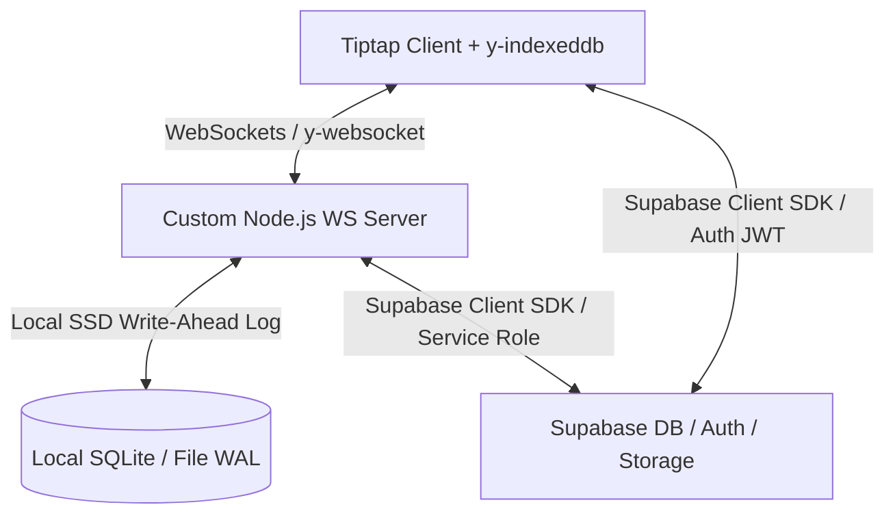

# Technical Design Spec: Local-First Collaborative Document Editor

A design specification for building a premium, local-first, collaborative document editor featuring offline synchronization, deterministic conflict resolution, granular version control, and cost-effective AI extensions.

---

## 1. System Architecture Overview

The system uses a hybrid architecture designed to achieve zero-latency UI responsiveness, real-time sync with other users, and low database costs on Supabase.



### Tech Stack
*   **Frontend**: Next.js 16 (App Router), Tailwind CSS, Shadcn UI, Radix Primitives.
*   **Editor Core**: Tiptap Editor (based on ProseMirror) with custom Yjs collaboration extensions.
*   **Database & Auth**: Supabase (PostgreSQL with Row-Level Security, Supabase Auth, and Supabase Object Storage).
*   **Conflict Resolution**: Yjs (CRDT) for both client-side and server-side state merging.
*   **Sync Server**: Custom Node.js WebSocket server running a `y-websocket` implementation.
*   **AI Integration**: Sarvam AI API (utilizing Indian language LLM, Text-to-Speech, and Translation models with free credits).

---

## 2. Database Schema & Storage Optimization

To keep the application highly cost-effective and scale well within the Supabase Free Tier, the database is optimized to store only metadata and text indices, while heavy Yjs CRDT binary payloads are offloaded to Supabase Object Storage.

### Database Tables (PostgreSQL / Supabase)

#### `profiles` (User Profiles)
Stores user account profiles linked directly to Supabase Auth.
```sql
CREATE TABLE profiles (
    id UUID PRIMARY KEY REFERENCES auth.users(id) ON DELETE CASCADE,
    email TEXT UNIQUE NOT NULL,
    full_name TEXT,
    avatar_url TEXT,
    created_at TIMESTAMP WITH TIME ZONE DEFAULT timezone('utc'::text, now()) NOT NULL
);
```

#### `documents` (Document Registry)
Stores document metadata and plain searchable text for indexing.
```sql
CREATE TABLE documents (
    id UUID PRIMARY KEY DEFAULT gen_random_uuid(),
    title TEXT DEFAULT 'Untitled Document' NOT NULL,
    owner_id UUID NOT NULL REFERENCES profiles(id) ON DELETE CASCADE,
    searchable_text TEXT DEFAULT '',
    is_public BOOLEAN DEFAULT false NOT NULL,
    created_at TIMESTAMP WITH TIME ZONE DEFAULT timezone('utc'::text, now()) NOT NULL,
    updated_at TIMESTAMP WITH TIME ZONE DEFAULT timezone('utc'::text, now()) NOT NULL
);
```
*(The actual binary Yjs document state is saved to Supabase Storage at `/documents/{document_id}/main_state.bin`)*

#### `document_members` (Access Permissions)
Junction table mapping users to document access roles.
```sql
CREATE TYPE member_role AS ENUM ('owner', 'editor', 'viewer');

CREATE TABLE document_members (
    id UUID PRIMARY KEY DEFAULT gen_random_uuid(),
    document_id UUID NOT NULL REFERENCES documents(id) ON DELETE CASCADE,
    user_id UUID NOT NULL REFERENCES profiles(id) ON DELETE CASCADE,
    role member_role NOT NULL,
    created_at TIMESTAMP WITH TIME ZONE DEFAULT timezone('utc'::text, now()) NOT NULL,
    UNIQUE (document_id, user_id)
);
```

#### `document_invitations` (Collaborator Invitations)
Stores pending collaboration invites.
```sql
CREATE TYPE invitation_status AS ENUM ('pending', 'accepted', 'declined');

CREATE TABLE document_invitations (
    id UUID PRIMARY KEY DEFAULT gen_random_uuid(),
    document_id UUID NOT NULL REFERENCES documents(id) ON DELETE CASCADE,
    inviter_id UUID NOT NULL REFERENCES profiles(id) ON DELETE CASCADE,
    invitee_email TEXT NOT NULL,
    role member_role NOT NULL,
    token UUID NOT NULL DEFAULT gen_random_uuid(),
    status invitation_status DEFAULT 'pending' NOT NULL,
    created_at TIMESTAMP WITH TIME ZONE DEFAULT timezone('utc'::text, now()) NOT NULL
);
```

#### `document_versions` (Version Timeline)
Stores timeline metadata for snapshots.
```sql
CREATE TABLE document_versions (
    id UUID PRIMARY KEY DEFAULT gen_random_uuid(),
    document_id UUID NOT NULL REFERENCES documents(id) ON DELETE CASCADE,
    version_name TEXT NOT NULL,
    created_by UUID NOT NULL REFERENCES profiles(id),
    created_at TIMESTAMP WITH TIME ZONE DEFAULT timezone('utc'::text, now()) NOT NULL
);
```
*(The actual binary version snapshot is saved in Supabase Storage at `/documents/{document_id}/versions/{version_id}.bin`)*

### Supabase Row-Level Security (RLS) Policies
*   **documents**:
    *   `SELECT`: User is owner (`owner_id = auth.uid()`) OR is member of the document (checked via `document_members`) OR the document is public (`is_public = true`).
    *   `INSERT`: Checked if user is authenticated and `owner_id = auth.uid()`.
    *   `UPDATE`: Checked if user is owner OR is member with role `editor`.
    *   `DELETE`: Allowed only if user is owner (`owner_id = auth.uid()`).
*   **document_members**:
    *   `SELECT`: User is member of the document OR user is owner of the document.
    *   `INSERT / UPDATE / DELETE`: Checked if current user is the document owner.

---

## 3. High-Performance, Low-Cost Sync Engine

To keep our database IOPS (Input/Output Operations) well within Supabase's free tier, the WebSocket server absorbs high-frequency keystroke updates and writes them to local disk before performing throttled flushes to Supabase Object Storage.

### 1. In-Memory Registry
The custom WebSocket server keeps active document Yjs instances (`Y.Doc`) in memory. 
*   **Cache Miss**: When the first client connects to a document, the WS server fetches the `main_state.bin` file from Supabase Storage and loads it into memory.
*   **Cache Hit**: Subsequent clients joining the document are served instantly from memory, performing **zero** database reads.
*   **LRU Eviction**: When the last client disconnects from a document, a 5-minute timer begins. If no one reconnects, the document state is flushed to Supabase, destroyed, and evicted from server memory.

### 2. Local Write-Ahead Log (WAL) & Throttled Database Saving
*   To prevent loss of edits during server crashes, the server immediately logs incoming client Yjs update packets to a **local SQLite database / append-only write-ahead log** on the server's SSD (which is free and supports unlimited fast operations).
*   The server consolidates and flushes the full state binary to Supabase Storage only **once every 10 minutes** of active editing, or **immediately when a document becomes idle** (no users left).
*   During this save, the server also updates the `searchable_text` column in the database by parsing the Yjs structure to plain text, enabling search indexing.

### 3. Client Acknowledgment (ACK) & Unload Protection
*   The client sets `hasUnsyncedChanges = true` locally as soon as edits are made.
*   The WebSocket server responds with a `sync-ack` once the update is safely appended to the **local server SSD log** (taking under 5ms).
*   Upon receiving `sync-ack`, the client clears `hasUnsyncedChanges = false`.
*   If the user attempts to close their browser window while `hasUnsyncedChanges` is true (due to network lag/offline status), a `beforeunload` dialog warns them of unsaved changes.

---

## 4. Collaborative Editing, Version Control & AI

### Collaborative Editing & Cursors
*   Tiptap renders the document UI. We use Yjs cursor presence to broadcast cursor positions, mouse selections, and user profile colors in real-time via WebSockets.
*   Active users' avatars are displayed dynamically in the editor header, matching the cursor colors assigned to them.

### Granular Version History & Reverts
*   **Creating Versions**: Users with editing rights can capture a named checkpoint. The server retrieves the in-memory Yjs binary state, saves a record to `document_versions`, and uploads the binary to `/documents/{document_id}/versions/{version_id}.bin`.
*   **Viewing History**: Clicking a version loads its binary file from Supabase Storage and initializes a read-only, detached `Y.Doc`. Tiptap displays this read-only version side-by-side with the editor.
*   **Safe Reverts**: Reverting to a version is performed by calculating the delta between the current state and the version's state, then applying it as a standard update transaction. This updates the text without breaking the state history or connection of other active collaborators.

### AI Integration (Sarvam AI API)
*   **Indian Language Translation**: Allows users to translate the entire document or a selection into 11+ Indian languages (Hindi, Bengali, Telugu, Tamil, Marathi, Gujarati, Punjabi, Kannada, Malayalam, Odia, etc.) in a single click using the `/translate` endpoint.
*   **Multilingual Text-to-Speech (TTS - Bulbul v3)**: Users can select text and hear it read aloud in a human-like Indian voice (e.g., Shubh, Aarav) in multiple target languages, with an in-app audio player in the editor sidebar.
*   **AI Chat & Writing Assistant (Sarvam-30B)**: Optimized for English and Indian languages (including native script, romanized, and Hinglish/code-mixed inputs). Supports:
    *   *Multilingual Summarization*: Summarizes complex text.
    *   *Grammar Correction & Rephrasing*: Polishes text in English or regional scripts.
    *   *Inline Autocomplete*: Ghost text completions powered by `sarvam-30b`.
*   **Security & API Integration**: Next.js Server Actions proxy all AI requests to keep the `api-subscription-key` secure. Queries verify the user's Supabase session before executing.

---

## 5. Sharing & Onboarding Flow

We use a zero-cost, multi-channel sharing mechanism:

1.  **In-App Notifications**:
    *   Owners can invite collaborators by email.
    *   Invitees receive a badge notification on their dashboard under a "Pending Invitations" section.
    *   Accepting the invite adds the user to `document_members`, instantly revealing the document in their dashboard.
2.  **Social Sharing & Token Links**:
    *   The Share modal displays a secure copyable link containing the invitation UUID token:
        `https://collab-editor.com/invite/{invitation_token}`
    *   **mailto: Template**: A "Share via Email" link prepopulates the user's default email client (`mailto:`) with a friendly invitation subject and body containing the invite link, ensuring a seamless sending experience without server email costs.
    *   If a guest clicks the link, they are prompted to log in/register. Once authenticated, they are greeted with an acceptance screen and granted access.
3.  **Public Access Toggle**:
    *   Owners can toggle a setting to make a document public.
    *   If `is_public` is true, the document URL (`/doc/{id}`) can be opened by anyone. The editor operates in a read-only state for unauthenticated users, and database RLS allows bypass for reading.

---

## 6. Verification Plan

### Automated Tests
*   **Unit Tests (`Vitest`)**:
    *   Verify Yjs state delta calculation and merging logic.
    *   Verify role permissions check logic (rejecting Viewer updates).
*   **E2E / Integration Tests (`Playwright`)**:
    *   Spin up two browser instances to verify real-time editing and cursor presence.
    *   Simulate network dropouts and verify that offline edits sync correctly upon reconnection.

### Manual Verification Checklist
1.  **Offline Editing**: Edit while offline, close tab to verify warning appears, reopen tab offline (content loaded from IndexedDB), reconnect internet, verify edits synchronize to database.
2.  **Viewer Restrictions**: Attempt to emit WebSocket update messages as a Viewer. Verify the server drops the packets and maintains document integrity.
3.  **Sharing & Invite Links**: Invite a user, send the invite link via email/Slack, click the link as a guest user, sign up, verify document access is immediately granted and loaded.
