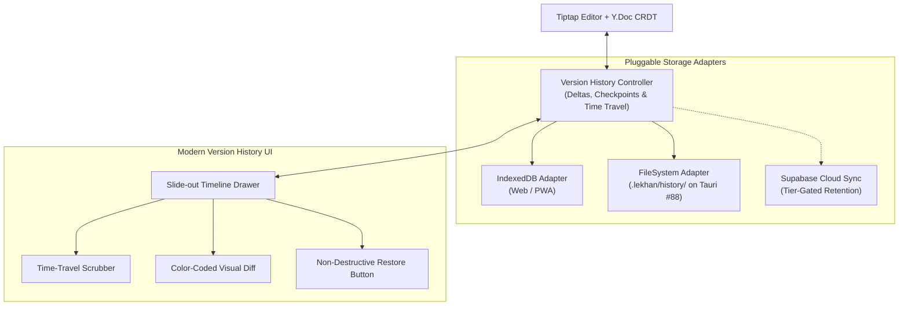

# Local-First Git-Style Version History Design Specification

**Issue Ref:** #82 (Tier Enforcement & Version History Overhaul)  
**Date:** 2026-08-27  
**Status:** In Review  
**Related Architecture:** ADR 0001 (Snapshot Encryption), ADR 0003 (Tauri Files-on-Disk), ADR 0004 (CRDT Sync Topology)

---

## 1. Overview & Motivation

Traditional cloud-centric document tools (Notion, Google Docs, Confluence) place version history entirely on remote servers. This introduces three core disadvantages:
1. **Artificial Paywalls**: Free users are subjected to 1-day or 7-day cloud retention limits because storing full historical snapshots on cloud storage (S3/Supabase) is expensive.
2. **High Latency & Cloud Reliance**: Scrubbing through document history requires remote API calls and asset downloads.
3. **Data Lock-in**: Users cannot inspect or revert changes when offline.

Lekhan flips this model by implementing a **Local-First, Git-Style Version History Engine**:
* **Unlimited Local History**: Users have infinite, immutable local version history stored directly on their device (via IndexedDB/OPFS in the browser, and `.lekhan/history/` packfiles on Desktop in Tauri #88).
* **Non-Destructive Commits**: Restoring any past checkpoint applies the state as a **new forward commit** (similar to `git revert`), ensuring current progress is never overwritten or lost.
* **Compact Delta Compression**: Leverages Yjs binary update deltas and browser-native Deflate compression, consuming under 500 KB for hundreds of checkpoints.
* **Tier-Enforced Cloud Retention**: The cloud layer only retains encrypted checkpoints according to the workspace plan (Free = 1 day, Plus = 90 days, Pro = 1 year), keeping infrastructure costs minimal while giving users 100% local power.

---

## 2. Core Architecture



---

## 3. Data Model & Storage Interface

### 3.1 Checkpoint Structure
Each checkpoint represents a named milestone or automated snapshot:

```typescript
export interface DocumentCheckpoint {
	id: string
	pageId: string
	workspaceId: string
	title: string
	authorName: string
	authorId: string
	createdAt: string // ISO timestamp
	isPinned: boolean // true for manual user milestones; false for auto-checkpoints
	byteSize: number
	compressedPayload: Uint8Array // Deflated Yjs binary state snapshot / delta
	stateVector?: Uint8Array
}
```

### 3.2 Abstract Storage Adapter (`VersionHistoryStorageAdapter`)
The engine interacts with storage through a strict TypeScript interface to support Web and Desktop environments:

```typescript
export interface VersionHistoryStorageAdapter {
	saveCheckpoint(checkpoint: DocumentCheckpoint): Promise<void>
	listCheckpoints(pageId: string): Promise<DocumentCheckpoint[]>
	getCheckpoint(pageId: string, checkpointId: string): Promise<DocumentCheckpoint | null>
	deleteCheckpoint(pageId: string, checkpointId: string): Promise<void>
	pruneAutoCheckpoints(pageId: string, maxStorageBytes: number): Promise<number> // returns pruned count
}
```

### 3.3 Storage Implementations
1. **`IndexedDBHistoryAdapter` (Web / PWA)**:
   * Uses IndexedDB database `lekhan_history_v1` with object store `checkpoints`.
   * Indexes on `pageId`, `createdAt`, and `isPinned`.
2. **`FsHistoryAdapter` (Desktop / Tauri #88)**:
   * Stores binary checkpoint packfiles in `.lekhan/history/<page-id>/<checkpoint-id>.bin` with a `manifest.json`.
3. **`MemoryHistoryAdapter` (Testing)**:
   * In-memory Map implementation for lightning-fast unit tests.

---

## 4. Checkpoint Creation & Retention Rules

### 4.1 Manual Milestones (Pinned)
* **Trigger**: User clicks **"Create Checkpoint"** (or `Cmd/Ctrl + Shift + S`) and enters a label (e.g., *"First Draft"*, *"Pre-edit submission"*).
* **Retention**: `isPinned: true`. **Never auto-pruned** unless explicitly deleted by the user.

### 4.2 Automated Snapshots (Rolling)
* **Trigger**: Automatically recorded after 15 minutes of active editing or on tab/window unload.
* **Retention**: `isPinned: false`. Subject to the local storage quota (default: 100 MB per workspace). When quota is approached, the oldest unpinned auto-checkpoints are pruned using an LRU policy.

### 4.3 Cloud Retention Cleanup Cron (Issue #82 Scope)
* In Supabase Cloud, a scheduled cleanup cron deletes expired `document_versions` records and storage objects matching plan limits:
  * **Free**: Prune checkpoints older than 24 hours.
  * **Plus**: Prune checkpoints older than 90 days.
  * **Pro**: Prune checkpoints older than 365 days.
* **Local device history remains 100% unaffected by cloud pruning.**

---

## 5. Non-Destructive Restore Engine (Git-Style Revert)

When restoring a checkpoint $V_k$:
1. The engine decompresses the Yjs snapshot of $V_k$.
2. It generates a differential update between the current editor document and $V_k$.
3. It applies this update to the active Y.Doc and immediately saves an automated checkpoint:
   * Title: *"Restored to milestone: [Original Checkpoint Title]"*
   * `isPinned: false`
4. The user's prior edits remain in the timeline and can be jumped back to at any time.

---

## 6. User Interface Overhaul

The legacy `components/version-history.tsx` will be replaced with a modern slide-out drawer:

1. **Header & Actions**:
   * Quick-add milestone button with custom title input.
   * Plan reassurance badge: *"Local history: Unlimited · Cloud backup: [Plan Retention]"*.
2. **Timeline List**:
   * Pinned milestones highlighted with distinct badges (`📌 Milestone`).
   * Grouped by date (Today, Yesterday, Last Week).
   * Filter toggle: *"All Checkpoints"* vs *"Milestones Only"*.
3. **Interactive Visual Diff & Preview**:
   * Split or unified diff view showing added text (green) and removed text (red strikethrough).
   * Time-travel scrub bar to quickly slide across versions.
4. **Safe Restore Workflow**:
   * Explicit confirmation dialog explaining: *"Restoring will create a new version checkpoint so your current work is always preserved."*

---

## 7. Verification & Testing Strategy

### 7.1 Automated Unit & Integration Tests
* `tests/unit/version-history-storage.test.ts`:
  * Verifies `saveCheckpoint`, `listCheckpoints`, `getCheckpoint`, and `pruneAutoCheckpoints`.
  * Tests Deflate compression and decompression integrity across large documents.
  * Tests LRU auto-pruning ensuring pinned milestones are never deleted.
* `tests/unit/version-history-restore.test.ts`:
  * Verifies non-destructive forward restore invariant: restoring $V_1$ from $V_5$ creates $V_6$ containing $V_1$'s content while preserving $V_1 \dots V_5$ in the adapter.
* `tests/unit/version-history-cloud-cron.test.ts`:
  * Tests the cloud retention cleanup query with mocked clock timestamps for Free (1d), Plus (90d), and Pro (1yr) tiers.

### 7.2 Manual Verification
* Verify creating 10+ milestones, scrubbing the timeline, viewing diffs, and restoring while in airplane/offline mode in Chrome DevTools.

---

## 8. Rollout & Milestones

1. **Phase 1**: Core storage adapters (`IndexedDBHistoryAdapter`, `MemoryHistoryAdapter`), compression helpers, and engine unit tests.
2. **Phase 2**: Slide-out timeline UI drawer, time-travel scrubber, and visual diff view.
3. **Phase 3**: Integration into `components/editor-workspace.tsx` with hotkey `Cmd+Shift+S`.
4. **Phase 4**: Supabase backend retention cleanup cron and distinct-collaborator ledger (completing all acceptance criteria of #82).
