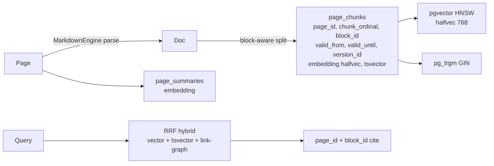

# H3 Studio: Thin v1 + Temporal v2 — Design

**Date:** 2026-08-30
**Status:** Draft (brainstorm approved, awaiting spec review)
**Related:** `2026-08-12-global-pkm-suite-strategy-design.md` H3 Suite (shelved), `docs/decisions/h3-studio/*` (01–07), `docs/decisions/external-input/chatgpt-strategy-summary-2026-08-29.md`, `docs/research/2026-08-29-notebooklm-studio-lekhan-feasibility.md`, `docs/research/2026-08-30-lekhan-h3-competitors-temporal-rag-deep-research.md`, `CONTEXT.md` Workspace→Page, ADRs 0003/0004, `docs/conversations/lekhan-conversation-transcript.md` Shared Vault

## 0. Summary

H3 is no longer “AI-Native Office” (Sheets/Slides/Mail/Chat as interactive editors). H3 is **NotebookLM/Open Notebook-like Studio at the Workspace root** — the factory that reads the live knowledge graph and writes back `Page`s, with `PPTX/XLSX/DOCX` as free exports of those `Page`s. This is more related to the core product (backbone for knowledge base, `2026-08-21 ses_fda1e907` “not a fit for office suite”) and is achievable solo-dev via deep modules in the existing modular monolith — solo pace is acknowledged, not penalized.

The Studio is **thin v1 first** (`06` open): corpus picker (`tag:`/`[[link]]`/explicit `Page`) → concatenate filtered `Page` markdown into prompt → `studio_create_pages` → new `Page` (graph-native, citable, versioned). Deep retrieval (`04` block-aware chunk + link-graph + two-tier + lexical fallback) and **temporal retrieval over `page_versions`** (the harder-to-copy wedge: “why did we change our mind on X?”) are **parked v2**, built only if thin v1’s tripwire fires (large corpora don’t fit context).

```mermaid
flowchart TB
  Vault[Vault *.md + .lekhan/sidecar<br/>ADR 0003] --> Hub[Hub y-websocket<br/>ADR 0004]
  Hub --> Graph[Graph index<br/>pages/page_links/page_tags<br/>searchable_text pg_trgm]
  Graph --> Studio[Studio thin v1<br/>picker → concat → AIClient<br/>→ studio_create_pages]
  Studio --> Pages[New Pages<br/>with [[cite]] + properties]
  Pages --> Export[Office export free<br/>pptxgenjs/exceljs/docx]
  Pages --> Graph
  Graph -.-> Deep[Deep v2<br/>page_chunks + pgvector<br/>RAG + temporal]
```

## 1. What Matters Most (Roadmap Triage)

**The extensive roadmap’s dilution is the risk** (`chatgpt-strategy-summary:13` “Build Notion” — PKM + collab + DBs + teams + publish + mobile + plugins + Sheets/Slides/Mail/Chat). Against Notion $865M ARR/1k employees and AFFiNE 70k★, solo-dev must collapse.

**Four phases, not three horizons:**

1. **Collaborative Markdown (now→H0):** Protect `ADR 0003` vault-on-disk + `ADR 0004` hub + `pages/page_links/page_tags` as *destination* architecture (browser→Supabase snapshots today is the gap, not the moat). This is what Obsidian won’t build (needs permanent hub) and Anytype/AFFiNE validated.
2. **Collaborative Knowledge (H1):** Graph view + backlink pane, publishing, import pipeline (Obsidian done), not DBs yet.
3. **Knowledge AI — Studio thin v1 (H3 MVP):** `06` as above. Validates *“do users want documents from their base?”* before deep work.
4. **Team Knowledge OS (H2+):** Team `Workspace` product (`is_team`, seats, SSO) after `#88` vault-on-disk + sidecar (Oct 13–Nov 3). Team revenue as byproduct of excellent individual PKM (Obsidian $25M/9 people), not Confluence chase (Rovo already wins there per `02`).

**Explicitly discarded:** Sheets/Slides/Mail/Chat as interactive editors → **respec’d as Studio grouped views** (`#52`/`#53` as `pptxgenjs`/`exceljs` renderers over `Page` `properties`, not editors). Plugin marketplace + themes stay H2. Office artifacts are **generated outputs**, not editors — solo pace makes this honest.

## 2. Competitor Lens & Agent Compat

| Player | Ship | Learn | Don’t copy |
|---|---|---|---|
| AFFiNE | Page ↔ Edgeless dual view (one file, two renders), Yjs+`y-octo` Rust | **One graph, many views** — Sheets/Slides as renders | MIT+cloud monetization |
| Anytype | Objects→Types→Relations, E2E p2p | Type system for `properties JSONB` | P2P-only, no native AI |
| Obsidian | **Bases 2026** `.base` over YAML, vault = folder, 2.7k unsandboxed plugins | Bases proves `properties`→DB staying markdown | Closed core, no collab |
| Notion | Enterprise Search + Custom Agents as MCP clients ($10/1k credits) | Agents as narrow workflow services | $20/seat + opaque credits |
| open-notebook | SurrealDB 3-tier, Esperanto 18 providers, podcast 1–4 speakers, job queue | Esperanto normalization (our `provider-registry` pattern) + async queue | Notebook-isolated silos — Studio must be **workspace-level** over live graph |

**Agent compat (phased, cost-safe — `Workspace` quota, never per-token, BYOK preserved):**

- **H3.0 MCP server (weeks, right after `page_chunks`):** `workspace.search({query, tag, linked_to, asOf})` / `get_page` / `create_page` / `graph.traverse` over `can_access_page()` RLS, Streamable HTTP + stdio via FastMCP. Any Claude/Cursor can query graph without agent runtime. This is why “full vault sharing with editing directly on file” (`transcript Shared Vault`: *Open vault → Share Vault → CRDT → file stays `.md`*) matters — it becomes `MCP read_page → edit .md → Tauri merge-on-launch`.
- **H3.5 MCP client:** Studio jobs call *one* external MCP (e.g., GitHub) as `external.search` — not open connectors.
- Both keep `Strategy §6` $0 guarantee vs Notion credits.

## 3. Pluggable Root & Licensing (Whole Product, Not Studio-Only)

**Stay modular monolith.** Notion sharded only persistence (480 logical shards) when VACUUM threatened; app stayed monolith for data locality. AFFiNE fuses docs+whiteboard via deep package seams (`blocksuite` + Rust), single Docker, Yjs+IndexedDB+WebSocket identical to Lekhan. For Yjs per-`Page` CRDT, `pages/page_links/page_tags` atomic `sync_page_graph`, Tauri sidecar, offline-first, **modular monolith dominates** until Studio throughput/team size forces a seam.

**Licensing — AGPL + MIT, not Obsidian-closed:** Obsidian closed Electron core + open `obsidian-api` types (Sync/Publish proprietary). Lekhan **AGPL on `core+hub`** (`LICENSE:1`, `package.json:5` §13 network copyleft prevents closed SaaS clone, makes self-host escape durable at `GET /api/source`) + **§7 MIT exception** (`LICENSE:542`) for 3 surfaces: community plugins, themes, client libs (Shogo/Epicenter pattern). Boundary `Strategy §8.1`: *where running on our infra begins*. Mitigations: per-directory `LICENSING.md` + `verify-license-isolation` CI + `SBOM` + no CLA until needed.

**Self-host escape is for users** (offer source to leave), **AGPL is for code theft** (can’t run closed clone), **depth is for idea theft** — ideas aren’t copyrightable, but 6 deep seams (`page_chunks` block-aware, `hybrid_search` RRF `halfvec`+`tsvector` + RLS, `studio_jobs` queue, link-graph expansion `page_links` in/out, `valid_from/until` temporal, plugin sandbox `Worker+iframe`+CSP+hostile fixtures) are weeks each — deep pockets can copy, but not the vault-data flywheel + trust that grows per `Page` kept as `*.md`.

**Pluggable root — 5 options, one graph stays Postgres:**

- **A Deep-modules monolith** (this H3): `ChunkIndexer`/`hybrid_search` `halfvec(768)` HNSW + `tsvector`, `studio_jobs`+Storage, `studio_create_pages` tx — **do for Studio v1** (weeks, one tx).
- **B Micro-frontends** — shallow, bundle dupe, breaks Yjs — **don’t**.
- **C Sandboxed plugin SDK** (Worker+iframe+postMessage, `read:pages`/`write:pages` + `http:allowlist`, CSP/nonce) — **build next**, makes `#52`/`#53`/`#54`/`#55` pluggable without splitting graph.
- **D Tauri sidecar** (dual store `.lekhan/embeddings/` + Postgres, `LocalEmbedder|RemoteEmbedder` adapter) — **stage after #88** (interface now, binary Nov).
- **E MCP tools** (`app/api/mcp` JSON-RPC) — **high leverage**, same root for agents + temporal.

**12-month call:** Don’t split. Ship 6 seams inside monolith (~6w total). Split only on signal (embedder P95>2s, queue >100/min for 1w, 3 pizza teams).

**H3 as Open Notebook iteration:** Yes — but graph-native (live `Workspace`, not silo), with `temporal` as the iteration.

## 4. Studio — Explicit Capabilities (Thin v1 vs Temporal v2)

**Thin v1 (MVP, `06` open):** Corpus picker reusing `AI Panel v2` mentions: `tag:X` / `links:[[Auth]]` / checked `Page`s + free-text filter → **no chunking/embeddings/`pgvector`** — concatenate filtered `Page` markdown into prompt (fits personal vault slice in 2M context, Gemini 2M window) → `AIClient` (`provider-registry`) → **one new RPC** `studio_create_pages(pages: {title, properties, body}[])` → `sync_page_graph` tx (new `Page`s with per-bullet `[[Title]]` cite + `properties` like `{status, prio}`). `PPTX/XLSX/DOCX/PDF` is free via `lib/export-utils.ts:284` (`pptxgenjs`/`exceljs`/`jspdf`) on that `Page` — no separate deliverable. Mind map is `page_links` graph view (no LLM). Quiz/Flash with score is LLM over 1–5 `Page`s.

*Tripwire:* large `tag` (100s `Page`s) won’t fit context, cost scales per call with no persistent index — exactly where deep version was built to help. If usage stays “few dozen filtered `Page`s,” deep may never be needed.

**Temporal v2 (parked, harder-to-copy):** The ChatGPT “killer” prompts — *“Find every decision we made about X and why we changed our mind”* / *“Compare what we believed 6mo ago to now”* — need **retrieval over `page_versions`** (`git-style milestones`, `ADR 0002` 1/90/365d retention, word-diff already exists), not just `searchable_text` current. Neither NotebookLM (static snapshot silo) nor Rovo (current-state search) nor generic `Claude+MCP` (no `page_versions`) can replicate — it depends on Lekhan’s own versioning model.

- **Retrieval when built (`04`):** Block-aware chunk (heading/callout boundaries, `block_id` ordinal) → one summary embedding per `Page` (title+summary) to narrow candidates → `chunk halfvec(768)` HNSW + `tsvector` hybrid RRF + `link-graph expansion` (`page_links` in/out, deliberate `[[wikilink]]` > code import) + `lexical fallback` `pg_trgm` for not-yet-embedded chunks. Two-tier: page summary → chunk.
- **Taxonomy:** `as-of` (`WHERE valid_from <= $asOf AND (valid_until IS NULL OR $asOf < valid_until)` over `page_chunks{page_id, chunk_ordinal, block_id, valid_from, valid_until, version_id, embedding, tsvector}`), `between` (change nodes + `page_versions` word-diff → changelog `Page` with before/after links), `implicit evolution` (hierarchical time summaries over diffs).
- **Schema implication if built:** `page_chunks` needs block-ordinal boundaries + `valid_from/until` + either `page_summaries` table or summary embedding column on `pages` — decide before migration, else re-embed twice.

**Output matrix (explicit, whole-product):**

| Group | Output | LLM vs Arch |
|---|---|---|
| **Graph-native (writes `Page`s)** — *H3 wedge* | Epic/Story `Page`s with `properties` + `[[cite]]` | Arch: RAG + bulk `tx` |
| | Briefing RFC `Page` per-bullet `[[Title]]` cite | RAG |
| **Office** | Deck `PPTX` / Sheet `XLSX` / `DOCX/PDF` | Renderers (client) |
| **Learning** | Quiz/Flash/hints + score, Reports+charts, Mind-map | LLM / No LLM |
| **Synthetic** | Podcast script→BYOK TTS, slidecast `PPTX+TTS+ffmpeg.wasm`, infographic `html2canvas` | Script trivial, TTS/video deep; **Cinematic Veo NOT H3** |

All gated by single `can_access_page()` (`01` one architecture), write-back keeps `Workspace` as trust boundary + offline via `#88` sidecar mirror later (`07`).

**Agentic playground use you described:** Research a topic → AI helps unstructured (chat) → drop into Lekhan → **structure it** (human edits + AI helps doc creation *even before docs exist* → `MarkdownEngine` + collab) → `Studio` at graph root generates output based on that knowledge (graph-native `Page` + optional `PPTX/podcast`). Full vault sharing (`transcript` Shared Vault: *Open your vault → Share Vault → invite → live CRDT → file stays `.md`*) is the precondition — that’s `Tauri #88` vault-on-disk + hub, not `page_members` per-Page sharing.

**Mismatch to keep in back of mind:** ChatGPT’s “share-a-whole-vault-at-once” vision vs shipped `page_members` per-`Page` (`architecture-facts/permission-substrate-vs-team-workspace.md`). Today vault share is bulk `page_members` inserts, not atomic `Workspace` membership — works for thin v1’s explicit `Page` picker, but `Workspace`-scoped Studio jobs will want `Workspace`-level membership (H2 `#49` seats/SSO). Keep flat: thin v1 uses explicit `Page` list, not implicit “whole vault,” until team `Workspace` ships.

## 5. Data Model & Retrieval Plan

**If/when deep built (parked, but schema decision is pre-migration):**



- Thin v1 needs **no** `page_chunks` — uses `searchable_text` + `tag`/`link` filters only.
- Deep v1 needs `page_chunks` + `page_summaries` (or `pages.summary_embedding`) + `valid_from/until` + `version_id` + `studio_jobs` queue + `Storage/studio_artifacts` bucket + `MCP` `asOf` param. Retention = tier (Plus 90d windowed, Pro 365d full) + reranker later. Valid until `H3 v2` (after Studio v1).

## 6. Components & Flow

- **Picker UI** (reuse `AI Panel v2`/`Mention`): `Workspace` → filter by `tag`/`link`/`search` → checked `Page`s + token estimate → prompt preview.
- **Thin v1 flow:** `Picker → concat markdown → AIClient (BYOK/BYOL) → parse response → studio_create_pages` (one `supabase.rpc` tx, `page_links`/`page_tags` via `sync_page_graph`) → new `Page`s appear in graph/search → optional `exportToPptx/Xlsx` client-side.
- **Deep flow (parked):** `Picker → hybrid_search(asOf?)` → link-graph expand → rerank → grounded generation with `page_id@version` cite → same `studio_create_pages`.
- **Async:** thin v1 is sync (prompt fits context); deep + synthetic (podcast/video) move to `studio_jobs` + `supabase Realtime` progress + `Storage` artifact (SurrealDB `surreal-commands` pattern in open-notebook, but on Supabase Queue).

## 7. Error Handling & Non-Goals

- Large corpus: thin v1 returns `413 Corpus too large for thin mode — narrow filter or wait for indexed mode` (tripwire, not silent truncation).
- E2E `Workspace` (opt-in Plus `ADR 0001`): server `searchable_text`/`page_links` disabled → Studio degrades to local-only (`WASM transformers.js` + sidecar mirror) or shows `E2E_ENABLE_LOCAL_INDEX` per `07`; parity matrix at toggle.
- Rate limits: per-user `BYOK` quota (not Lekhan), `429` surfaces provider `Retry-After`; cost never on Lekhan (`Strategy §6`).
- **Non-goals (explicitly deferred):** Interactive Sheets/Slides/Mail/Chat editors ( `04` deep RAG before them per `chatgpt-strategy-summary:13` “collapse roadmap”), full `MCP client` open connectors (one curated GitHub proxy first), `A2A`, cinematic Veo.

## 8. Testing

- Thin v1: `corpus picker` unit (tag/link/explicit, token estimate), `studio_create_pages` tx (backlinks appear, `page_tags` mirrored), `exportToPptx/Xlsx` snapshot (single-slide regen), E2E: pick 3 `Page`s → generate → new `Page` appears in `search_pages` with `[[cite]]`.
- Deep (parked): `page_chunks` block-boundary, `hybrid_search` RRF vs pure vector/lexical, `as-of`/`between` over `page_versions` (VersionRAG 90% vs 58% naive), link-graph expansion precision, `valid_until` correctness on `page_versions` prune, hostile `can_access_page` filter (no cross-workspace leak).

## 9. Open Questions

- Chunk = `Tiptap` block vs 800-token window? (block-aware per `04`).
- E2E `WASM` embeddings ship with v1 or degrade to `pg_trgm`?
- Embedding model pinned vs `Workspace`-choice with re-embed cost?
- `chunk retention = page_versions` tiers exactly or milestone-only?
- Slide revisions = `Page` edits (versioned) vs `Storage` artifacts?
- `Workspace`-scoped sharing vs per-`page` `page_members` bulk — vault-share UX until `#49`?

## 10. Risks & Mitigations

- Thin v1 cost scales per call with no index — mitigated by being the tripwire.
- Deep `04` competes with `#88` Tauri + `#29` billing — mitigated by parking deep until thin validates.
- Solo-dev + deep pockets out-marketing — mitigated by `AGPL` code + vault-data flywheel + `Bases`-like `properties` staying markdown.
